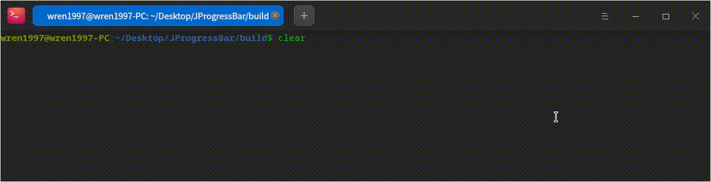

# JProgressBar

[[中文]](README_CN.md)

This is a very simple and easy to use C++ progress bar header file. You only need to refer to the examples in `example` to get started very easily.

Here's how it works.



Its source code is.

```cpp
#include "jprogress_bar.hpp"
#include <thread>
using namespace Joger::ProgressBar;

...

    {
        printf("task1: calc something\n");
        JProgressBar bar(100);
        for (double i = 0; i <= 100; ++i)
        {
            bar.update(i);
            std::this_thread::sleep_for(std::chrono::milliseconds(10));
        }
        bar.end();
    }

    {
        printf("task2: send files\n");
        JProgressBar bar(1024.6); // 1024.6MB
        for (double i = 0; i <= 100; ++i)
        {
            bar.update(i);
            std::this_thread::sleep_for(std::chrono::milliseconds(10));
        }
        bar.end();
    }
```

## Features

### Customize the style of the progress bar.

You can customize the style of the progress bar by modifying the constants defined in the header file

By default it looks like this.

### Can adapt to the console width

The default progress bar takes up 80% of the console width, so you don't have to pay attention to the console width.

## Stargazers

[](https://github.com/ZhengqiaoWang/JProgressBar/stargazers)

## Forkers

[](https://github.com/ZhengqiaoWang/JProgressBar/network/members)